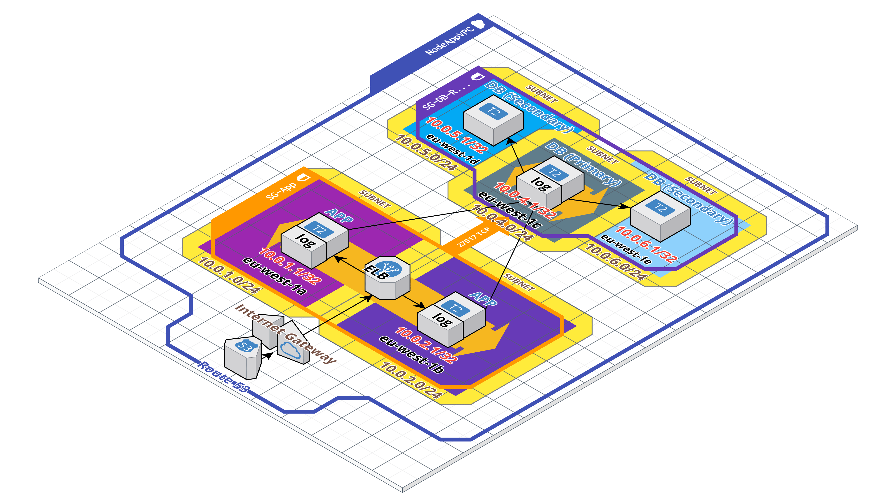
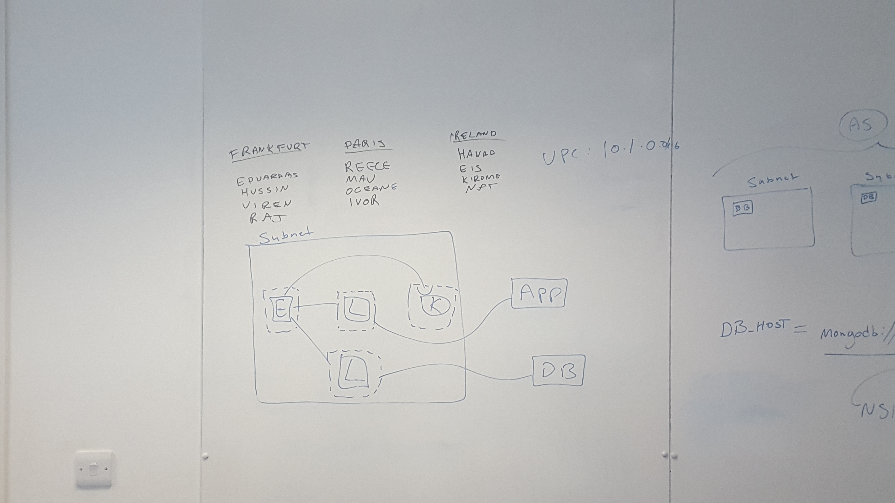
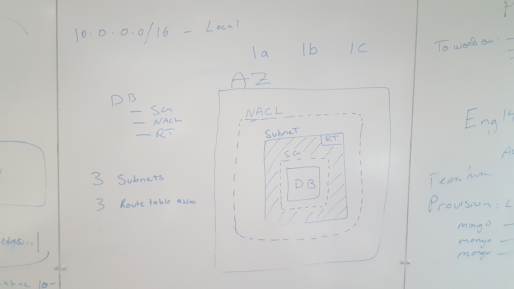
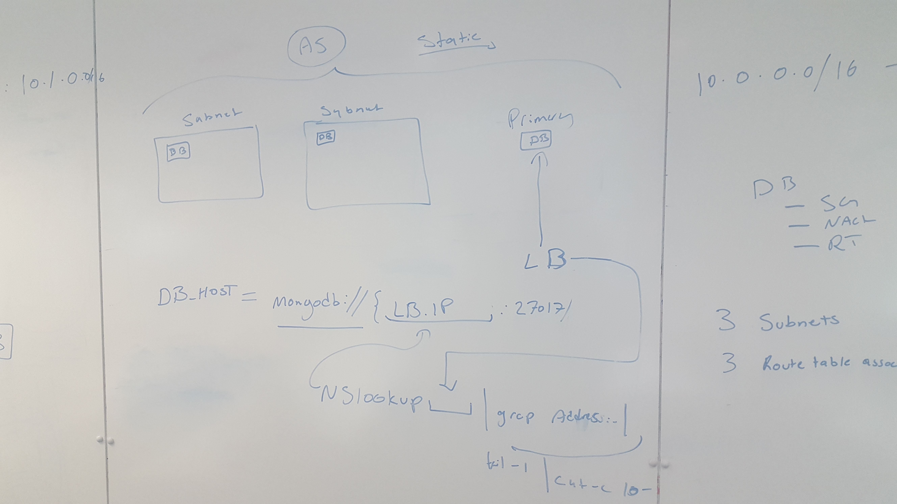
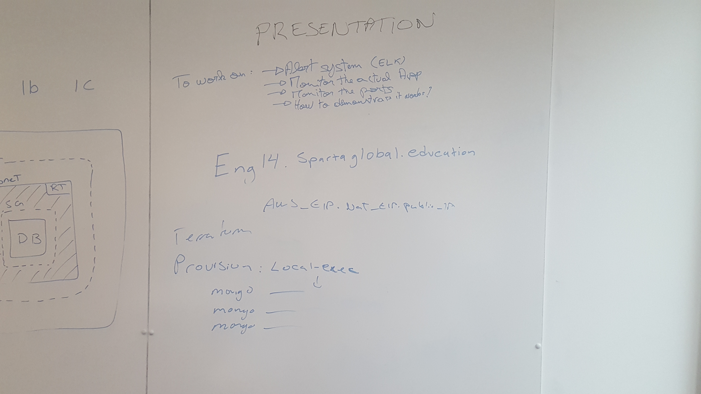
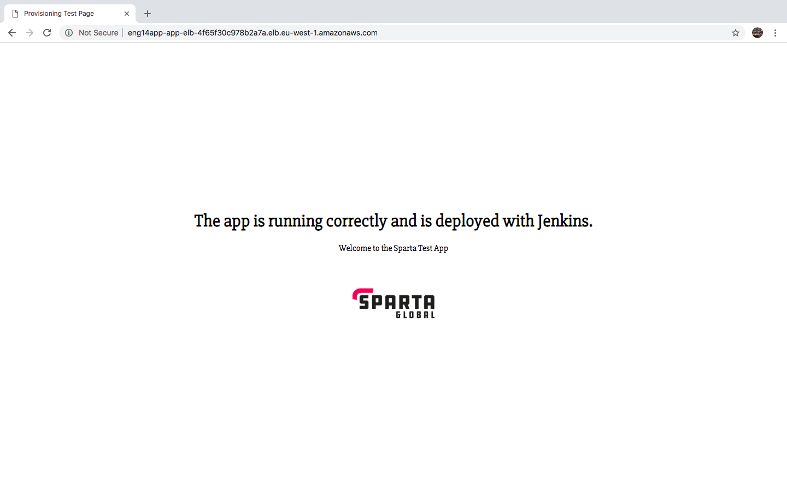

# Eng14Final
___

## What we have created?
We have created a 2-tier architecture which contains 3 Mongodb instances and 3 Node App instances. The architecture is placed within 3 availability zones in AWS, each containing a database instance and an app instance. Each instance is provisioned through cookbooks created in Chef, which are tested through both unit tests and integration tests. We have also created 3 cookbooks to provision an ELK stack, each for the Elasticsearch, Logstack, Kibana. The ELK stack is used to help manage, monitor and analyse logs within the architecture. This would be useful for debugging the architecture, recording any errors made within it. For the database, we have made one of the three instances the primary database, which will take on all the database requests made by the app instances. The other database instances are made into secondaries, which will be used replicate the primary at all times and will replace the primary once the current primary has been corrupted.  

___

## Diagrams
| | This is the diagram of the architecture, made using  https://cloudcraft.co/. This gives the overview of the architecture. |
| ------------- |:-------------:|
| - |This shows the plan made in creating the replica set for the architecture.|
| |This shows the plan made in planning the VPC for the database instances and where to put them within AWS.|
|| This is the plan of linking the ELK stack to the app and database.|
-----


## How to run the architecture?
### Home
To access the app within the 2 tier architecture, in your web browser, search for the following URL:
```
eng14app-app-elb-4165f30c978b2a7a.elb.eu-west-1.amazonaws.com
```
You will be able to see this once you enter the DNS name.

