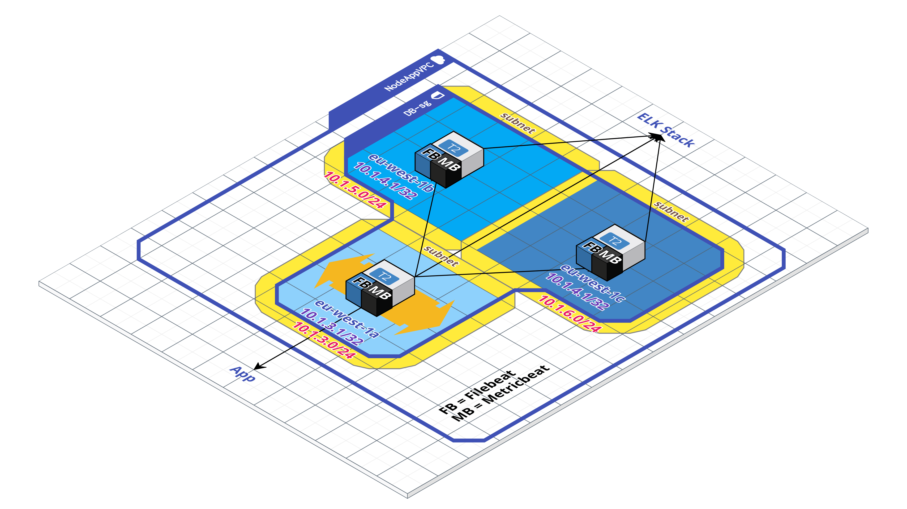

# Eng14Final
# Contents

* [ What we have created. ](#what-we-created)
* [ How to run the project. ](#how-to-run)
* [ Mongo Replica-set. ](#mongo-replica-set)
    1. [ Database. ](#database)
        * [ Solution 1: Load Balancer. ](#solution-1)
        * [ Solution 2: EIP. ](#solution-2)
        * [ Solution 3: ](#solution-3)
        * [ Final Solution: ](#final-solution)
    1. [ How it works. ](#how-it-works)
        * [ To deploy the replica-set manually. ](#manual-replica)
* [ Multi AZ Project. ](#multi-az-app)
    1. [ Deployment. ](#deployment)
* [ ELK Stack. ](#elk-stack)
    1. [ What Is The ELK Stack? ](#what-is-elk)
    1. [ The ELK Stack In This Project.  ](#elk-in-project)

---

## <a name="what-we-created"> What we have created?</a>
We have created a 2-tier architecture which contains 3 Mongodb instances and 3 Node App instances. The architecture is placed within 3 availability zones in AWS, each containing a database instance and an app instance. Each instance is provisioned through cookbooks created in Chef, which are tested through both unit tests and integration tests. We have also created 3 cookbooks to provision an ELK stack, each for the Elasticsearch, Logstack, Kibana. The ELK stack is used to help manage, monitor and analyse logs within the architecture. This would be useful for debugging the architecture, recording any errors made within it. For the database, we have made one of the three instances the primary database, which will take on all the database requests made by the app instances. The other database instances are made into secondaries, which will be used replicate the primary at all times and will replace the primary once the current primary has been corrupted.

##  <a name="how-to-run">How to run the project</a>
To run the project on your own machine you would need to do the following:
- Clone the repository inside your chosen directory.
- Make sure you're inside the root folder with the terraform file inside.
- Run the command
```
terraform init
```
    which  will initialise a working directory containing Terraform configuration files.
- Run the command
```
terraform plan
```
    which will create an execution plan. It checks whether the execution plan for a set of changes matches your expectations without making any changes to real resources or to the state.
- Run the command
```
terraform apply
```
    which applies the changes required to reach the desired state of the configuration, or the pre-determined set of actions generated by a ``` terraform plan ``` execution plan.
- Navigate to your browser and enter the following link into your navigation bar ```eng14.spartaglobal.education```. This will open the app.
- Inside your navigation bar, go to ```eng14.spartaglobal.education/posts``` to navigate to the posts page which will get the posts from the database.


##  <a name="mongo-replica-set">Mongo Replica-set</a>

Our 2 tier architecture currently has a serious Single Point of Failure; the database tier.
We currently only run a single instance in a single availability zone. If this were to fail we would not only have down time but we would also have a serious loss of data.
Investigate how to create a replica set using mongo that allows three machines to replicate data and balance the load across three availability zones.

### <a name="database"> Database </a>
Initially we has one database inside an availability zone which made it prone to crashes which in turn would create down time for the database. To resolve this issue we had an EC2 instance inside all of the availability zones (eu-west-1a, eu-west-1b and eu-west-1c) that can automatically recover from a database failure, you can see the architecture diagram bellow. For example, if you are running a database in eu-west-1a and that database goes down the app would use another database inside the other 2 availability zones until the crashed database is booted up again.



When creating the database to be autoscaled, we came across four solutions which would make the app connect to the database, but those solutions didn't work well as they were always giving us a bad gateway error message. These solutions are:

#### <a name="solution-1"> Solution 1: Load Balancer</a>
Our first approach was to create a Load Balancer to get the IP of the primary database instance, as the autoscaled database instance didn't have an instance ID. This was an issue because without the instance ID we couldn't get the private IP of said database instance into the user data of the app. The way we got the IP of the primary database was using the Load Balancers DNS, but monogodb only accept ip's as a valid input. To get the DNS' IP we used this command in the user data file:
```
nslookup [DNS link] | grep -i address:- | tail -1 | cut -c 10-
```
This command filtered the output we got from the nslookup to only display the IP. The IP was added to the db_host, but after trying out the APP to see if it could connect to the database, we received a 502 bad gateway error. The cause of this was the fact that the DNS ip of the load balancer wasn't the right one to allow connection to the database.

#### <a name="solution-2"> Solution 2: EIP</a>
Our second approach was to add an EIP to our instance, but there was an issue where we couldn't get the instance ID because the database instances were made with an autoscaler. The way we added associated the EIP with the instance is by adding a nat gateway inside the public subnet which shadows the databases private subnet. This way was easier to assign IP's in the user data, as we can directly access the EIP.

When connecting to the database through the app we encountered the same problem we had with solution 1. we were received a 502 bad gateway error. The cause of this was the fact that the EIP wasn't the right one to allow connection to the database.


#### <a name="solution-3"> Solution 3: </a>


#### <a name="final-solution"> Final Solution: </a>


##  <a name="mongo-replica-set">Mongo Replica-set</a>

Our 2 tier architecture currently has a serious Single Point of Failure; the database tier.
We currently only run a single instance in a single availability zone. If this were to fail we would not only have down time but we would also have a serious loss of data.
Investigate how to create a replica set using mongo that allows three machines to replicate data and balance the load across three availability zones.

### <a name="how-it-works">how it works</a>
To deploy a replica-set, we need to make sure that mongo is installed and mongod service is running. So we made a mongo cookbook that would allowed us to create an AMI with packer to make sure that all DB instances have the two requirements to deploy a replica-set.

Here is the link to our mongo cookbook:
https://github.com/RCollettSG/ChefMongoCookbook


Once everything is correctly setup, run:  
```
terraform init
```

This is to initialise a working directory containing our Terraform configuration files.

If terraform is initialised correctly, run:
```
terraform plan
```
This is to create an execution plan for you to see if everything in your terraform files meet all the requirements.

If all requirements are met, run:
```
terraform apply
```

When terraform apply is executed successfully, go on AWS, get the public IP address from your App instance and make a request to '/posts'.

You should be able to see the posts page of the web application.

Now, to check if the replica-set is deployed correctly and is working, go on AWS and terminate the Primary DB instance. When reloading the posts page, you should still be able to see all the posts page.

This is because when the Primary goes down, the other two Secondary members will undergo an 'election'. The member with a healthier state will get elected as the new Primary.

#### <a name="manual-replica">To deploy the replica-set manually</a>

This is what our mongo cookbook AMI will automatically do for you. Only do the following if you are not using the available AMI.
```
sudo apt-key adv --keyserver hkp://keyserver.ubuntu.com:80 --recv EA312927
```

This is to ensure the authenticity of software packages by verifying that they are signed with GPG keys, so we first have to import the key for the official MongoDB repository.

```
echo "deb http://repo.mongodb.org/apt/ubuntu xenial/mongodb-org/3.2 multiverse" | sudo tee /etc/apt/sources.list.d/mongodb-org-3.2.list
```

This is to create a list file for MongoDB.
```
sudo apt-get update
```
This is to update the package list.
```
sudo apt-get install -y mongodb-org
```
This will install several packages containing the latest version of MongoDB
```
sudo systemctl start mongod  
```
This is to start the mongod service

To check if your mongod service is running, you can run
```
mongod
```
and it will tell you the status of the service.

Now, you need to reconfigure your mongod.conf file.

To do so, run
```
sudo vi /etc/mongod.conf
```
or
```
sudo nano /etc/mongod.conf
```
Inside the file, you will need to make sure that under 'Net Interface', it should have the following lines:

```
net:
  port: 27017
  bindIp: 0.0.0.0
```
Port 27017 is the default port for MongoDB, and since we will be using several hosts which will ensure that MongoDB will listen for connections from applications on your configured addresses.

Under 'Replication', it should have the following lines:
```
replication:
  replSetName: Eng14
```
This is so that your replica-set members will fall under the same replica group.

Once you are done making the change to the mongod.conf file, save and exit from there and restart the mongod service with the following command:
```
sudo systemctl restart mongod
```

Now ssh into the mongo shell with the following command:
```
mongo
```

With the provision of our mongo cookbook and the image we've created using packer, the replica-set should have already been deployed.

To check if the replica-set exists, run:
```
rs.status()
```

That should then display a list of all the DBs, one should have a status of "Primary", and two should have a status of "Secondary".

If none are displayed, it would mean that the replica-set has not been initialised, you would need to run:
```
rs.initiate({_id: "replSetName", members: [{_id: 0, host: "your db private IP address:27017"}]})
```

Once your Primary DB has successfully been initialised, you can then add the other two DBs to the replica-set as a Secondary member.
```
rs.add({_id: 1, host: "your second db private IP address:27017"}, {_id: 2, host: "your third db private IP address:27017"})
```
Once the two are added to the replica-set successfully, when you run 'rs.status()', you should now be able to see all three members of the set, one Primary and two Secondaries.

To ensure that whatever is written onto the Primary member get replicated to the Secondary members, you need to setup a master-slave relationship for the set.
Exit the mongo shell.

```
mongod --master --dbpath /data/masterdb/
```
This command should be run inside the Primary virtual environment.

```
mongod --slave --source <hostname><:<port>> --dbpath /data/slavedb/
```
This command will set the other two members as a slave.

-----

##  <a name="multi-az-app">Multi AZ Project</a>
Using Terraform and AWS create a load balanced and autoscaled 2 tier architecture for the node example application.
The Architecture should be a "Highly Available" application. Meaning that it has redundancies across all three availability zones.
The application should connect to a single database instance.

####  <a name="deployment">Deployment</a>
To deploy multiple instances in multiple availability zones, we've created an autoscaling group resource on Terraform, and configured it so that there is always 3 App instances running if one was to go down. This is to have the app architecture as a "Highly Available" application.

For the App, you will need to make sure that you are using the correct Node ami_id, which is **ami-04daf51b01dbbf693**.

For the autoscaling to spin up instances across three different availability zones, we have created three subnets, three route tables and three route table associations, one for each of them. This is so that when the instances are spun up, they will have its own subnets for different availability zones.

If the main availability zone was to fail, our App within the zone will also fail. With the other two zones being available, our app will be able to stay online. And because we have the autoscaling group configured to always have 3 instances running, another app instance will get deployed and replaced the one that has failed.


---

## <a name="elk-stack">ELK STACK</a>
Immutable architectures are notoriously difficult to debug because we no longer have access to the instances and thus do not have access to the logs for those machines.
Log consolidation allows us to have logs files broadcast to a central repository by the instances themselves which allows us to more easily view them.
The ELK stack is a commonly used system for this purpose.
Research the setup of the elk stack and create a cookbook for provisioning the required machines.

## <a name="what-is-elk">What Is The ELK Stack?</a>

"ELK" is an acronym for three projects, Elasticsearch, Logstash, and Kibana, from the open-source company Elastic. Beats is also a part of the stack, not included in the acronym.

Filebeat and MetricBeats, part of the Beats family, are used to forward logs and system metrics, such as CPU and memory data, to Logstash.

Logstash is a data processing pipeline that ingests data from multiple sources, transforms it, and then sends it to Elasticsearch.

Elasticsearch is a RESTful, JSON-based search and analytics engine, which packages the data from Logstash into a JSON format to be sent to Kibana.

Kibana lets users visualise logs and system data with charts and graphs.

## <a name="elk-in-project">The ELK Stack In This Project</a>

FileBeat and MetricBeat have been installed on the Node App and Mongodb AWS instances, in order to monitor all machines.

Logstash, Elasticsearch and Kibana have been installed on three separate AWS instances to store, manipulate and display log data for the user.

Filebeat sends logs from the Node App and Mongodb instances to Logstash. MetricBeat sends system metrics from those instances to Logstash as well. The type of logs that Filebeat sends can be set by user, by setting log file pathways in the Filebeat configuration file.

Logstash identifies named fields from the logs it receieves, such as the log id or log time, and sends this data to Elasticsearch. Elasticsearch then packages the data into a JSON format and sends it to Kibana. Kibana then displays the information received from Elasticsearch as charts and graphs. The user can filter the logs on Kibana to display particular data, such as all metric data for a single database instance for example.

## Setting Up The ELK Stack

In order to incorporate the ELK Stack into the project, Cookbooks were created using Chef, containing Recipes to provision the instances that hold their part of the stack. Chef also allows us to run unit and integration tests on the Cookbooks, using ChefSpec and InSpec respectively.

Here are the links to the Cookbook repositories on GitHub:

Logstash: https://github.com/IvorL/logstash_cookbook  
Elasticsearch:  https://github.com/Mhaventhan/ElasticsearchCookBook  
Kibana: https://github.com/oceaneLonneux/kibanaCookbook   
Beats: https://github.com/RCollettSG/BeatsCookbook  

Each Cookbook contains a README explaining installation.
